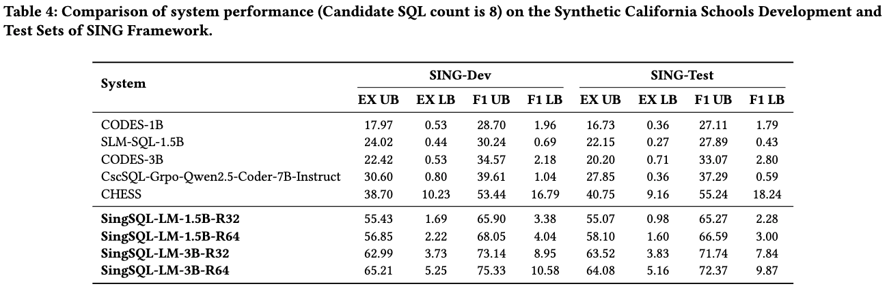

# SING-SQL: A Synthetic Data Generation Framework for In-Domain Text-to-SQL Translation

[](https://www.arxiv.org/abs/2509.25672)  [](https://www.alpcaferoglu.com/posts/sing-sql)  [](#citation)

## Table of Contents
- [Overview](#overview)
- [Main Results](#main-results)
- [Data Statistics](#data-statistics)
- [Models](#models)
- [Dataset](#dataset)
- [Citation](#citation)

## Overview

SING-SQL is a fully automated two-stage framework for generating high-quality, high-coverage synthetic Text-to-SQL data for any target database — without relying on SQL logs or manual annotations.

The framework:

- Partitions the database schema hierarchically into table-level and column-level sub-schemas.
- Presents a quality-aware SQL–Text generation pipeline that incorporates complexity-controlled SQL synthesis, LLM-as-a-judge validation, executability checks, automatic SQL repair, and reasoning trace generation.
- Balances schema coverage with a column-focused generation step to include underrepresented attributes.

<div align="center" style="background-color:white; display:inline-block; padding:10px; border-radius:8px;">
  
</div>

## Main Results

###  Comparison of system performance on the California Schools subset of the BIRD development benchmark
<div align="center" style="background-color:white; display:inline-block; padding:10px; border-radius:8px;">
  
</div>

### Comparison of system performance (Candidate SQL count is 8) on the Synthetic California Schools Development and Test Sets of SING Framework
<div align="center" style="background-color:white; display:inline-block; padding:10px; border-radius:8px;">
  
</div>


## Data Statistics
SING-SQL produces datasets with comprehensive schema coverage and broader SQL diversity.  
Below, we highlight join complexity and aggregation usage across BIRD and our synthetic splits.

### Question Count Comparison 
Question counts per difficulty level for the California Schools database in BIRD-Dev and synthetic splits:

| Dataset             | Overall | Simple | Moderate | Challenging | Window |
| ------------------- | ------- | ------ | -------- | ----------- | ------ |
| **BIRD-Dev**        | 89      | 54     | 30       | 5           | 2      |
| **Synthetic Train** | 34,266  | 8,685  | 8,556    | 8,046       | 9,286  |
| **Synthetic Dev**   | 1,124   | 297    | 259      | 259         | 319    |
| **Synthetic Test**  | 1,124   | 299    | 248      | 248         | 340    |

### Join Count Comparison
The average number of joins per SQL query across difficulty levels.  
This demonstrates that SING-SQL captures **more complex relational reasoning patterns** compared to BIRD.

<p align="center">
  
</p>

### Aggregation Comparison
The proportion of SQL queries with aggregation operators across levels.  
Our synthetic dataset provides **richer coverage of aggregations** at moderate, challenging, and window levels.

<p align="center">
  
</p>

## Models
We released SingSQL-LM, a family of compact language models fine-tuned on the synthetic data of California Schools database, achieving state-of-the-art in-domain performance.


| **Model**                                |Specialized Database          | Base Model                   | Train Method | HuggingFace                                                                                  |
|------------------------------------------|------------------------------|------------------------------|--------------|----------------------------------------------------------------------------------------------|
| SingSQL-LM-1.5B-R32_CS                   | California Schools           | Qwen2.5-Coder-1.5B-Instruct  | SFT          | [🤗 HuggingFace](https://huggingface.co/alpcaferoglu/SingSQL-LM-1.5B-R32_CS)                 |
| SingSQL-LM-1.5B-R64_CS                   | California Schools           | Qwen2.5-Coder-1.5B-Instruct  | SFT          | [🤗 HuggingFace](https://huggingface.co/alpcaferoglu/SingSQL-LM-1.5B-R64_CS)                 |
| SingSQL-LM-3B-R32_CS                     | California Schools           | Qwen2.5-Coder-3B-Instruct    | SFT          | [🤗 HuggingFace](https://huggingface.co/alpcaferoglu/SingSQL-LM-3B-R32_CS)                   |
| SingSQL-LM-3B-R64_CS                     | California Schools           | Qwen2.5-Coder-3B-Instruct    | SFT          | [🤗 HuggingFace](https://huggingface.co/alpcaferoglu/SingSQL-LM-1.5B-R64_CS)                 |


## Dataset

- The synthetic data generated using SING-SQL is available for the California Schools Database.
- It includes train, dev, and test splits with full schema coverage and balanced complexity levels.

| **Dataset**                   | HuggingFace                                                                                  |
|-------------------------------|----------------------------------------------------------------------------------------------|
| California Schools            | [🤗 HuggingFace](https://huggingface.co/datasets/alpcaferoglu/california_schools_synth)      |


## Citation

If you find this repository helpful, please cite the following paper:
```
@misc{caferoğlu2025singsqlsyntheticdatageneration,
      title={SING-SQL: A Synthetic Data Generation Framework for In-Domain Text-to-SQL Translation}, 
      author={Hasan Alp Caferoğlu and Mehmet Serhat Çelik and Özgür Ulusoy},
      year={2025},
      eprint={2509.25672},
      archivePrefix={arXiv},
      primaryClass={cs.AI},
      url={https://arxiv.org/abs/2509.25672}, 
}
```